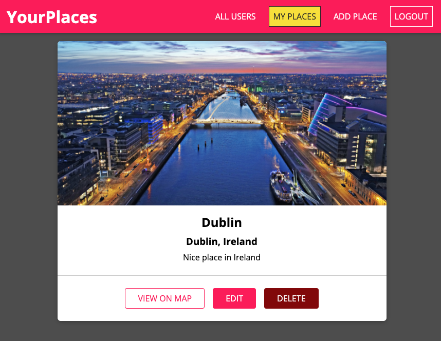

# Fullstack MERN (Mongo, Express, React, NodeJS) REST API

  

Hosted on Firebase and Heroku <a href="https://mern-places-frontend.web.app/">https://mern-places-frontend.web.app/</a>

<b>Build using modern React concepts and practices</b>
